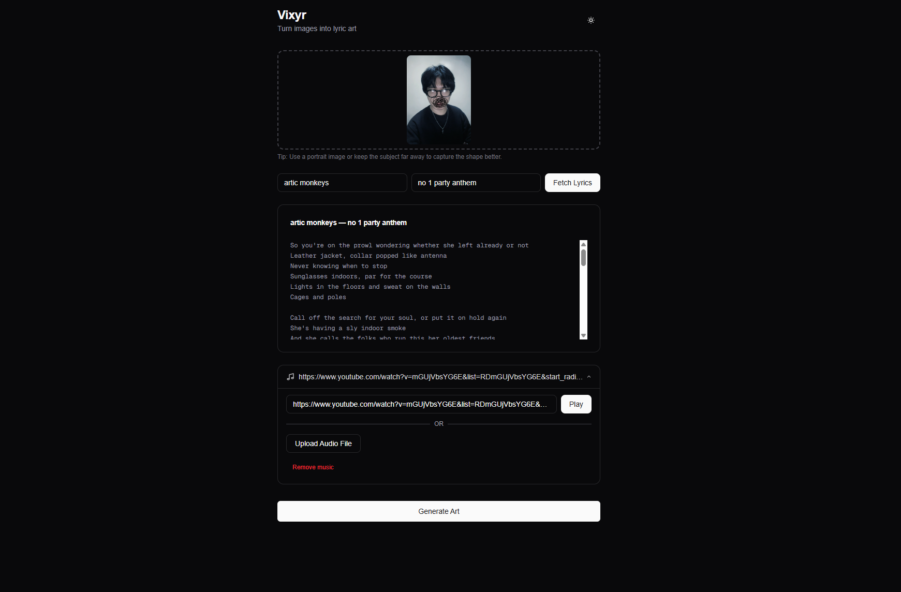
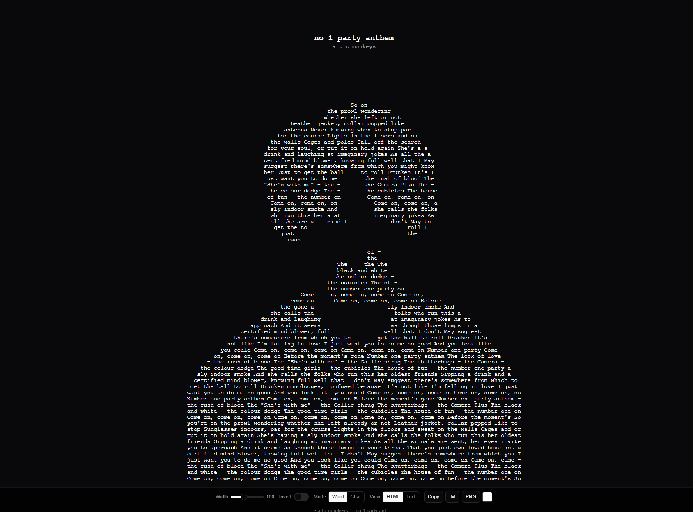

# Vixyr

**Turn images into art made of song lyrics.**

Upload an image, pick a song, and watch your image transform into text
art where every character comes from the lyrics of your chosen music.

## Screenshots
>
> 
> 

## Features

- **Char Mode** — Classic ASCII art using density-ranked lyric characters
- **Word Mode** — Lyrics words flow through dark regions to form the image shape with Otsu threshold + morphological clean
- **Auto music playback** — Background music via YouTube (hidden) or audio upload
- **Dark / Light mode** — Auto-detects system preference + manual sun/moon toggle, no flash
- **Export** — Copy as text, download `.txt`, save as PNG via `html-to-image`
- **Font color picker** — Customize text color independently of theme
- **Responsive scaling** — Art fills the viewport, adjusts live on resize
- **Manual lyrics fallback** — Paste lyrics when auto-fetch fails
- **Hide/show controls** — Toggle the bottom controls bar for a clean full-screen view
- **Song title + artist** — Displayed on the art in both HTML and text views
- **SEO-friendly** — Open Graph, Twitter cards, JSON-LD WebApplication schema, sitemap, robots.txt
- **Privacy-first** — All image processing is client-side. No images uploaded to any server. Session storage cleared after processing.

## How It Works

```
1. Upload an image  →  canvas scales it smoothly
2. Enter Artist + Song Title  →  lyrics fetched via lyrics.ovh (no auth needed)
3. (Optional) Paste YouTube URL or upload audio for background music
4. Click Generate  →  image brightness maps to lyric characters
5. Adjust width, invert, font color  →  art updates live
6. Copy, download .txt, or save as PNG
```

## Tech Stack

| Layer | Technology |
|-------|-----------|
| Framework | [Next.js 16](https://nextjs.org/) (App Router) |
| UI | [React 19](https://react.dev/), [shadcn/ui](https://ui.shadcn.com/), [Tailwind CSS 4](https://tailwindcss.com/) |
| Image processing | Canvas API (fully client-side, no uploads to server) |
| Lyrics API | [lyrics.ovh](https://lyrics.ovh/) — free, no authentication |
| Music | YouTube iframe embed / native `<audio>` |
| Export | [html-to-image](https://github.com/bubkoo/html-to-image) |
| Fonts | Geist by Vercel |

## Getting Started

```bash
git clone https://github.com/ignaciocarlo/vixyr.git
cd vixyr
npm install
npm run dev
```

Open [http://localhost:3000](http://localhost:3000).

### Build for production

```bash
npm run build
npm start
```

## Project Structure

```
vixyr/
├── app/
│   ├── components/           # React components
│   │   ├── ImageUploader.tsx # Drag-and-drop image upload
│   │   ├── SongSearch.tsx    # Artist/title inputs
│   │   ├── SongInfo.tsx      # Lyrics display + manual paste fallback
│   │   └── MusicPlayer.tsx   # YouTube URL / audio upload
│   ├── lib/                  # Business logic
│   │   ├── imageProcessor.ts # Canvas scaling, char/word processing
│   │   ├── lyricsService.ts  # lyrics.ovh API client
│   │   └── densityMap.ts     # Character density ranking
│   ├── types/                # TypeScript interfaces
│   ├── result/
│   │   └── page.tsx          # Result page (art display + controls)
│   ├── ThemeProvider.tsx      # Dark mode context + toggle
│   ├── layout.tsx            # Root layout, SEO, JSON-LD
│   ├── page.tsx              # Input page
│   ├── globals.css           # Tailwind + CSS variables + class-based dark mode
│   ├── sitemap.ts            # XML sitemap
│   └── robots.ts             # Robots.txt
├── components/ui/            # shadcn/ui components
│   ├── button.tsx
│   ├── input.tsx
│   ├── slider.tsx
│   ├── switch.tsx
│   └── card.tsx
├── lib/
│   └── utils.ts              # cn() utility
├── public/
│   └── dark-mode.js          # Pre-hydration dark mode script
├── .github/
│   └── screenshots/          # Screenshot placeholders
├── eslint.config.mjs
├── next.config.ts
├── package.json
├── tsconfig.json
├── postcss.config.mjs
└── README.md
```

## Image Processing Pipeline

### Char Mode

```
Canvas smooth scale → Grayscale → Density map → Char placement
```

Every pixel maps to a character from the lyrics, ranked by visual density.

### Word Mode

```
Canvas smooth scale → Grayscale → Contrast stretch → Otsu threshold
→ Morphological open → Segment detection → Word fill
```

Words from the lyrics flow through the dark regions of the image to form the shape.

## Privacy

All image processing happens in the browser using the Canvas API.
No images, lyrics, or personal data are sent to any server.
Session storage is cleared immediately after the art is generated.

## License

[MIT](LICENSE)
